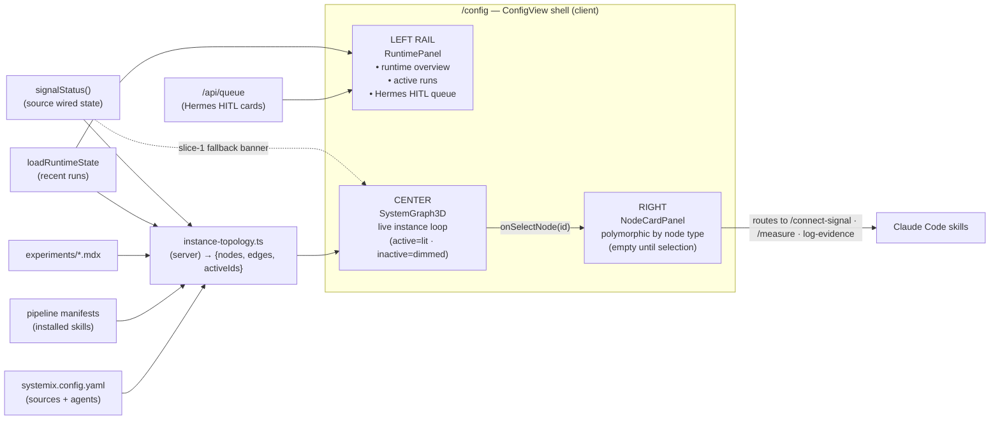

# Application Architecture — Node-centric Home (`/config`)

> Decisions, rationale, and alternatives live in **ADR-021** (`decisions/ADR.md`). This brief is the
> buildable spec: container view, node-state model, the topology-builder contract, reuse analysis, and the
> staged build plan. SSOT note: this repo records decisions in `decisions/ADR.md` (ADR-021), not in
> `docs/product/architecture/adr-*.md` (that dir holds only the older `hermes-skill-update` run).

## Problem & constraints (from the founder)

Rethink `/config` (Home) for clarity. Five constraints:
1. Hermes stays visible.
2. Runtime + HITL cards on a side panel.
3. The 3D graph shows **real data**; nodes with no data flowing are **dimmed but still shown** (onboarding).
4. Runtime → **left**; the **right** is reserved for a card shown **when a node is selected**.
5. "No signal connected" → **node-card state**, not a floating banner.

Locked design decisions (this session): graph = **the live instance loop** · active/dim = **live activity/data** · scope = **design fully, build staged**.

## C4 — Level 2 (Container view)



Selection is **controlled by `ConfigView`** (lifted out of `SystemGraph3D`): the graph emits `onSelectNode(id)`, `ConfigView` holds `selectedId` and renders the right-column card. The graph keeps camera-fly + neighbour-highlight, driven by the controlled `selectedId`.

## Three-column layout

```
┌──────────────┬───────────────────────────────┬──────────────────┐
│ LEFT (w-80)  │ CENTER (flex-1)               │ RIGHT (w-80/96)  │
│ Runtime      │ 3D live instance loop         │ Node card        │
│ + Hermes     │ search ▲left · legend ▼left   │ (empty until a   │
│ HITL queue   │ active lit / inactive dimmed  │ node is selected)│
│ (was right)  │ gear/settings · zoom ▼right   │ polymorphic      │
└──────────────┴───────────────────────────────┴──────────────────┘
```

## Node-state model (the live instance loop)

| Node type | Source of nodes | "Active" rule (else dimmed) | Card content (right panel) |
|---|---|---|---|
| **source** | `signals.<source>` + `type:` (wired/mcp/manual) | wired **and** receiving (recent evidence) | unwired → "No signal connected" + `/connect-signal`; manual → "Log evidence"; wired → last sync + volume + `evidence check` |
| **skill** | pipeline manifests (installed slash-commands) | run recently (`loadRuntimeState`) | what it does + the command to run it |
| **agent** | `systemix.config.yaml` `atlas.agents` (Hermes, …) | has pending/recent queue cards | the agent's queue + recent activity |
| **artifact** | `experiments/*.mdx` | running **with** evidence | verdict / evidence / decision (reuse VerdictStrip pattern) |
| **infra / concept / tool** | config + known surfaces | referenced by an active edge | `NODE_META` description |

Edges = the loop: `source → experiment → measure → Hermes → decide → learn`.

## Topology-builder contract (new — `src/lib/state/instance-topology.ts`, server)

```
buildInstanceTopology(): { nodes: SystemNode[]; edges: SystemLink[]; activeIds: Set<string> }
```
Pure read of file-backed state (no network): config + manifests + experiments + runtime + queue + `signalStatus`. `activeIds` drives full-color rendering; everything else falls into `dimNodeIds`. Reuses the existing `SystemNode`/`SystemLink` types + `TYPE_COLOR_*` from `system-graph.ts` (which keeps its types/colors, drops being the data origin).

## Reuse Analysis (HARD GATE)

| Existing component | File | Overlap | Decision | Justification |
|---|---|---|---|---|
| ConfigView | `src/app/config/ConfigView.tsx` | layout shell; will host selection + 3 columns | **EXTEND** | already a flex shell with the right panel; add left rail + lift `selectedId` (~30 LOC), not a rewrite |
| SystemGraph3D | `src/components/graph/SystemGraph3D.tsx` | graph + selection + dimming + fly | **EXTEND** | `selectedId`/`onNodeClick`/`dimNodeIds`/`flyTo` already exist; add `selectedId`+`onSelectNode` as controlled props |
| NodeInfoPanel | `src/components/graph/NodeInfoPanel.tsx` | node detail rendering | **EXTEND → NodeCardPanel** | repurpose into the polymorphic right-column card; reuses its structure, adds type-branching + actions |
| RuntimePanel | `src/app/config/RuntimePanel.tsx` | runtime + HITL | **EXTEND** | relocate left (`border-l` → `border-r`, column order); content unchanged |
| HitlQueue | `src/components/systemix/HitlQueue.tsx` | Hermes cards | **REUSE** | unchanged; already embedded in RuntimePanel |
| signalStatus | `src/lib/state/instance-config.ts` | source wired state | **REUSE** | feeds source-node `activeIds` + the source card (built in ADR-020) |
| system-graph.ts | `src/lib/data/system-graph.ts` | node types + colors + (empty) data | **EXTEND** | keep types/colors/`TYPE_LABEL`; data origin moves to the topology builder |
| instance-topology | `src/lib/state/instance-topology.ts` *(new)* | read 5 state sources → graph | **CREATE NEW** | no existing module reads config+manifests+experiments+runtime+queue into `{nodes,edges,activeIds}`; `system-graph.ts` is a static data module, not a reader — extending it would conflate data-shape with state-IO |

Only one true CREATE NEW (the topology builder); it has no overlap to extend. NodeCardPanel is an extension of NodeInfoPanel.

## Staged build plan

**Slice 1 — layout + card model (no topology dependency).** Lift `selectedId` to `ConfigView`; flip `RuntimePanel` to a left rail; add the right-column `NodeCardPanel` (polymorphic shell, with the source/unwired state carrying ADR-020's "no signal" + `/connect-signal`). **Keep the floating banner as a fallback** (it still fires from `unwiredSignals` while the graph is empty). *Verify:* `/config` renders 3 columns, runtime on the left; build + vitest green; light+dark.

**Slice 2 — populate the live loop (the Phase-5 core).** Add `instance-topology.ts`; feed `SystemGraph3D` real `nodes`/`edges` + `activeIds`→dim set; once nodes exist, **retire the floating banner** (source state now lives in its node card). *Verify:* the dogfood instance renders its real loop; inactive nodes dimmed-but-present; selecting the PostHog source shows the "no signal" card.

**Slice 3 — follow-on (separate).** Decouple `social-signal` from PostHog (manual evidence writes to the experiment directly, not via PostHog) + fix its stale `contract/hypotheses` path; add `type:` to `signals.<source>` + serializer round-trip.

## Changed assumptions (back-propagation)

- **ADR-020** shipped a floating top-center "no signal connected" banner as the *primary* surface. ADR-021 demotes it to a **slice-1 transitional fallback**; the durable home for that state is the source node's card. No code from ADR-020 is wasted — `signalStatus` + the banner both survive into slice 1.
- **v7 plan Phase 5** ("force-graph → pipeline runtime topology") is no longer a standalone phase; it is **slice 2** of this feature.

## Wave decisions summary

- **Pattern:** node-centric Home; controlled-selection in the shell; a server-side topology builder feeding a presentational 3D graph (ports-and-adapters: the builder is the read-port over file state).
- **Paradigm:** existing (React/TS, functional components) — unchanged.
- **Key components:** ConfigView (shell) · SystemGraph3D (extended) · NodeCardPanel (new, from NodeInfoPanel) · RuntimePanel (relocated) · instance-topology.ts (new).
- **Constraints established:** topology builder is a pure file-backed read (no network); the graph is always fully present (dim = inactive, never hidden); selection state is single-sourced in ConfigView.
- **Upstream changes:** none to prior-wave stories (no DISCUSS artifacts for this feature — the founder's directive is the requirement input).
