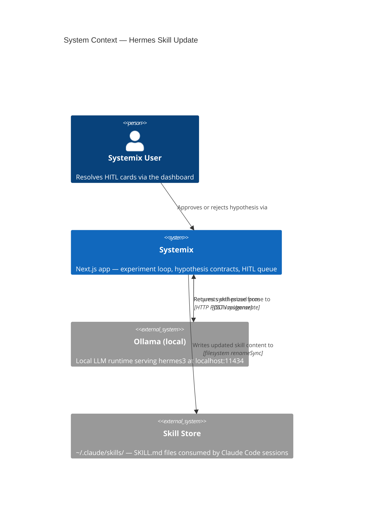
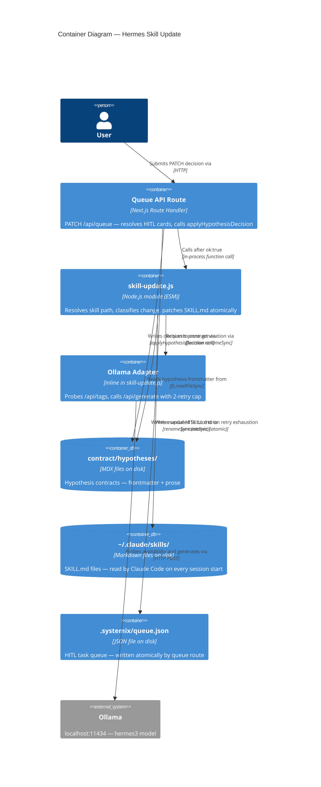

# Product Architecture Brief

## System Architecture

*Section reserved for Titan (infrastructure architect). Not yet populated.*

## Domain Model

*Section reserved for Hera (domain architect). Not yet populated.*

## Application Architecture

### Context

After a HITL card is resolved in the dashboard queue, Systemix writes the decision back into the hypothesis contract (`.mdx` frontmatter) via `applyHypothesisDecision` in `src/app/api/queue/route.ts`. Today the loop ends there. The hypothesis is marked `complete` but the Hermes skill file (`~/.claude/skills/hermes/SKILL.md`) that Hermes reads before synthesizing future evidence is never updated with what was learned.

This means every subsequent Hermes invocation starts cold — it cannot distinguish a direction that was already tested and rejected from one that has never been tried. The skill-update feature closes that gap: when a hypothesis decision is committed to disk, the relevant `SKILL.md` is updated to carry a structured `## Past Decisions` block forward.

### Option Selected: B — Isolated Module

Option B was selected after evaluating three options:

| Option | Description | Rejected reason |
|--------|-------------|-----------------|
| A — In-place extension | Extend `applyHypothesisDecision` directly in `route.ts` | Violates single-responsibility; adds Hermes I/O and filesystem concerns to an HTTP handler that already owns queue state mutation |
| B — Isolated module | New `skill-update.js` module called from `route.ts` after `applyHypothesisDecision` returns `ok:true` | Cleanest boundary; zero coupling to queue internals; independently testable |
| C — Event-driven | Emit a `hypothesis.closed` event and consume it asynchronously | Adds an event bus not present in the codebase; disproportionate complexity for a single consumer |

### Architecture Pattern

**Modular CLI with isolated command modules, ports-and-adapters at the Hermes boundary.**

The existing application is a modular monolith: Next.js server-side route handlers own all state mutations, scripts own all batch processing, and the MCP server owns all structured contract reads/writes. `skill-update.js` follows the same pattern — it is a pure server-side module with no framework dependency, callable from any trigger point.

The Hermes boundary (Ollama API at `http://localhost:11434`) is an external, optional dependency. It must be treated as a driven adapter: availability is not guaranteed (Ollama may be stopped), and the module must degrade gracefully when it is absent. The probe contract (see Earned Trust section) governs this boundary.

### Component Map

```
src/app/api/queue/route.ts       — existing; owns PATCH /api/queue
  └── calls applyHypothesisDecision(card, decision) → { ok, error? }
        └── [after ok:true] calls skillUpdate.update(hypothesisId, decision, card)

src/lib/skill-update.js          — NEW; the isolated module
  ├── resolveSkillPath(hypothesisId)   — maps hypothesis → SKILL.md path via skill-tags frontmatter
  ├── classifyChange(existingMd, newDecision)   — regex diff → "structural" | "bullet-level"
  ├── buildPatch(existingMd, decision, card)    — produces the updated SKILL.md content
  └── writeAtomic(skillPath, content)           — SKILL.md.tmp → renameSync

packages/mcp-server/src/tools/contract.ts   — existing; contractWriteHypothesisResultHandler
  └── already uses .tmp + renameSync — pattern confirmed, reuse

~/.claude/skills/hermes/SKILL.md            — target file written by skill-update.js
  └── ## Past Decisions section (structured, cumulative, append-only)

Ollama adapter (inline in skill-update.js)
  └── probe(): GET /api/tags → check model list → emit health.startup.refused if absent
  └── generate(prompt): POST /api/generate → fire-and-forget, 2-retry cap, HITL on second failure
```

### Trigger Points

Two trigger points in the existing codebase both call `applyHypothesisDecision`:

1. **`src/app/api/queue/route.ts` — `PATCH` handler** (primary): Lines 251-258. After `applyHypothesisDecision` returns `{ ok: true }`, call `skillUpdate.update(...)`. This is the dashboard-driven path.

2. **`src/app/api/evidence/route.ts` — `close` action** (secondary, if it exists): Any route that calls `applyHypothesisDecision` and transitions status to `complete`. The same pattern applies: call after confirmed `ok: true`. If this file does not yet exist, this trigger point is deferred.

The trigger is synchronous invocation, not event-driven. Rationale: see ADR-001.

### C4 System Context (L1)



### C4 Container (L2)



### Technology Stack

| Component | Technology | License | Rationale |
|-----------|-----------|---------|-----------|
| Module runtime | Node.js (ESM), already in repo | MIT | Zero new dependency; matches existing scripts |
| Atomic write | `fs.renameSync` (Node stdlib) | N/A | Already established pattern in `contract.ts` and `queue/route.ts`; POSIX-atomic on macOS/Linux |
| Ollama client | `fetch` (Node 18+ native) | N/A | No SDK needed; pattern already in `generate-contracts.ts` |
| Change classification | Regex diff (stdlib) | N/A | Deterministic, zero-latency; no model judgment needed (see ADR-002) |
| Skill path resolution | Frontmatter `skill-tags` field | N/A | Existing MDX frontmatter pattern; no new infrastructure |
| Test enforcement | TypeScript strict + ESLint (already configured) | MIT | Existing toolchain; no additional setup |

No new npm dependencies introduced. No proprietary services.

### Hermes Adapter — Earned Trust (Principle 12)

The Ollama endpoint is an external dependency with documented failure modes:
- Ollama process not running (most common in dev)
- Model not pulled (`hermes3` absent from local store)
- macOS sleep / Docker networking interrupting the socket

**Probe contract:**

```
probe():
  1. GET http://localhost:11434/api/tags
  2. Parse JSON → check models array includes an entry matching /hermes/i
  3. On success: proceed
  4. On connection refused OR model absent: emit structured log
       { event: "health.startup.refused", adapter: "ollama", reason: "...", action: "skill-update.skipped" }
     and return { available: false } — caller silently skips the update
  5. Probe is called once per skill-update invocation (not cached across requests)
```

Probe is not optional. The composition-root invariant is: probe → generate → write. If probe fails, generate and write are not attempted.

**Retry cap:** 2 attempts with 500ms delay between. On second failure, push a HITL card to `.systemix/queue.json` with type `skill-update-failed` and the hypothesis ID, so the team can trigger the update manually.

**Environmental lie detection:** On macOS overlayfs or tmpfs, `renameSync` is atomic within the same filesystem. The probe does NOT test `renameSync` atomicity (that is a POSIX guarantee on the target platform). It only probes the network dependency.

### Integration Patterns

**Synchronous inline call (fire-and-forget semantics):** `skill-update.update()` is called synchronously from the PATCH handler but does not block the HTTP response. The response to the dashboard is sent after `applyHypothesisDecision` succeeds. The skill update runs after the response is committed, using Node's event loop. If the skill update fails, it pushes a HITL card — it does not fail the HTTP response. Rationale: see ADR-001.

**Atomic file write:** `SKILL.md.tmp` is written first, then `renameSync(tmp, target)`. This is the same pattern established in `contract.ts` (lines 624-626) and `queue/route.ts` (lines 77-79). No new pattern introduced.

**Change classification:** The diff between the existing `SKILL.md` content and the proposed patch is classified as `structural` (section added or removed) vs `bullet-level` (line within an existing section changed). This classification drives HITL escalation threshold. See ADR-002.

### Acceptance Criteria (Behavioral)

These criteria describe observable behavior, not implementation:

**AC-1 Happy path — Hermes available:**
Given a hypothesis card of type `hypothesis-validation` is approved via PATCH,
When `applyHypothesisDecision` returns `ok: true`,
Then the relevant SKILL.md contains a `## Past Decisions` entry matching the hypothesis ID, decision, and date, within the same request cycle.

**AC-2 Hermes unavailable — silent skip:**
Given Ollama is not running at `localhost:11434`,
When a hypothesis card is approved,
Then the HTTP response is still `200 OK`, the hypothesis contract is correctly updated, no SKILL.md is written, and a structured log entry with `health.startup.refused` is emitted.

**AC-3 Hermes unavailable after 2 retries — HITL card:**
Given Ollama is running but returns an error on both attempts,
When a hypothesis card is approved,
Then a HITL card of type `skill-update-failed` appears in `.systemix/queue.json` with the hypothesis ID, within the same request cycle.

**AC-4 Skill resolution from frontmatter:**
Given a hypothesis contract has `skill-tags: [hermes]` in its frontmatter,
When the skill update runs,
Then the write targets `~/.claude/skills/hermes/SKILL.md` and no other skill file.

**AC-5 Skill resolution — default fallback:**
Given a hypothesis contract has no `skill-tags` field,
When the skill update runs,
Then the write targets `~/.claude/skills/hermes/SKILL.md` (the default skill for the Hermes agent).

**AC-6 Atomic write — no partial state:**
Given the process is interrupted between the tmp write and the rename,
When the system recovers,
Then the original SKILL.md is either unchanged (rename not completed) or fully updated (rename completed) — no partial content is observable.

**AC-7 Structural change — HITL escalation:**
Given the proposed patch classifies as `structural` (new section added),
When the skill update runs,
Then a HITL card of type `skill-update-review` is pushed to the queue alongside the write, flagging the structural change for human review.

### Quality Attribute Strategies

**Reliability:** Atomic write guarantees no partial state. Hermes failure does not fail the HITL resolution. Retry cap prevents unbounded blocking.

**Maintainability:** Isolated module with single responsibility. No coupling to queue internals beyond the function call signature. Change classification is deterministic (regex), not model-dependent — future changes to classification logic are isolated to one function.

**Testability:** The module exposes three pure functions (`resolveSkillPath`, `classifyChange`, `buildPatch`) and one side-effectful function (`writeAtomic`). Tests for the pure functions require no mocks. Tests for `writeAtomic` use a temp directory. The Ollama adapter can be replaced by a stub for unit tests.

**Observability:** Every meaningful event emits a structured log entry with a fixed `event` key. The `health.startup.refused` event is machine-readable for future monitoring integration.

### Architectural Enforcement

The following rules are recommended for enforcement via the existing ESLint configuration:

1. `skill-update.js` must not import from `src/app/` (no framework dependency)
2. `skill-update.js` must not import from `packages/mcp-server/` (no MCP coupling)
3. `src/app/api/queue/route.ts` must only call `skillUpdate.update()` after an explicit `ok: true` guard

These rules can be encoded as ESLint `no-restricted-imports` patterns pointing to the module boundary.

### External Integrations

Ollama (`http://localhost:11434`) is a local external service. It is not a third-party cloud API, so consumer-driven contract testing (Pact) is not applicable. However, the probe contract (above) serves the same function: it verifies the adapter can honor its contract before use.

If Ollama is ever replaced by a cloud LLM endpoint, the platform-architect should annotate that boundary for consumer-driven contract tests at that time.
